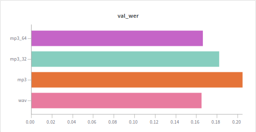

# [NeMo](https://github.com/NVIDIA/NeMo)
### setup
```shell
docker build -t s2t -f Dockerfile_nemo .
# see german_asr.md in my notes
```

### fine-tuning
* [gtcooke94 diskussion](https://github.com/NVIDIA/NeMo/issues/1510)
   * [gist by gtcooke94](https://gist.github.com/gtcooke94/89d933cda31ee75fec3c32e295b5b718)
### TODO
* unicode for manifests: `json.dump(metadata, f, ensure_ascii=False)`

### Info
* [pretrained models](https://api.ngc.nvidia.com/v2/models/nvidia/nemospeechmodels)
* rclone , synchronize to colab
```
rclone sync -P --exclude ".git/**" --exclude ".idea/**" --exclude "build/**" --exclude "*.pyc" --max-size 100k $HOME/code/SPEECH/NeMo dertilo-googledrive:NeMo
```

### Questions
* why is `preprocessor` and `spec_augmentation` done within `forward`? why not in dataloader?
* why not black formatted?
* no sortish sampler or bucketing? "simply" take huggingface's `DistributedSortishSampler`
* why soundfile which is unable to read mp3 ? 
* what about `environment.yml` ?
* what is `strict=False` in `from_pretrained` good for?

#### why not mp3 ? 
```
569M	/content/LibriSpeech/dev-other-processed_wav
60M	/content/LibriSpeech/dev-other-processed_mp3
78M	/content/LibriSpeech/dev-other-processed_mp3_32
149M	/content/LibriSpeech/dev-other-processed_mp3_64
```


### Sagemaker

##### [build container](https://github.com/aws/deep-learning-containers/blob/master/custom_images.md)

* `--force-reinstall` (see Dockerfile) makes Dockerfile practically non-appendable (cause it reinstalls big+fat torch!!), thus produces a base-image from which one can inherit
```shell script
docker build -f Dockerfile_base -t 706022464121.dkr.ecr.eu-central-1.amazonaws.com/pytorch-nemo:1.6.0-cpu-py3-base .
aws ecr get-login-password --region eu-central-1 | docker login --username AWS --password-stdin 706022464121.dkr.ecr.eu-central-1.amazonaws.com/pytorch-nemo
docker push 706022464121.dkr.ecr.eu-central-1.amazonaws.com/pytorch-nemo:1.6.0-cpu-py3-base
```
1. data
    * 